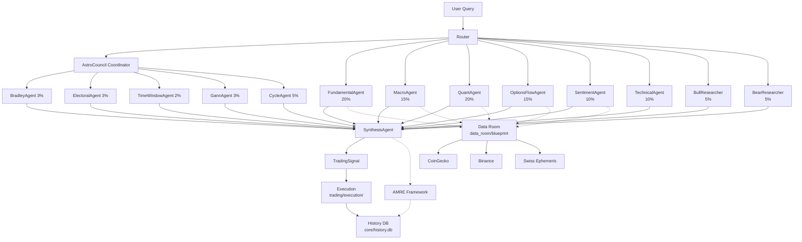

# Architecture - AstroFin Sentinel V5

Last updated: 2026-06-30

## Overview

AstroFin Sentinel V5 is a multi-agent trading system combining:
- **RAG-First** knowledge retrieval (knowledge/rag_retriever.py)
- **LangGraph** orchestration (orchestration/sentinel_v5.py)
- **Multi-Agent Council** of 16 analytical agents
- **Hybrid Signal** synthesis with weight-based conflict resolution

## System Diagram

## Layer Map

| Layer | Path | Purpose |
|-------|------|---------|
| Entry | orchestration/ | LangGraph routing, sentinel_v5.py main loop |
| Council | agents/_impl/ | 16 active agents (see docs/AGENT_REGISTRY.md) |
| Synthesis | agents/_impl/synthesis_agent.py | Weighted merge + conflict resolution |
| Data | data_room/ | Single ingress for external APIs (R3) |
| Core | core/ | ephemeris, aspects, volatility, history_db |
| Meta-RL | meta_rl/ | OAP, ATOM-KARL, backtest loops |
| Web | web/ | FastAPI + Flask dashboard, data_room API |
| Trading | trading/ | Execution, TWAP, risk gates |
| Bridge | bridge/roma/ | ROMA execution bridge (closed-loop SaaS) |
| Infra | infrastructure/ | atom-federation-os, AsurDev, home-cluster-iac |

## Data Flow

1. User query enters via `orchestration/sentinel_v5.py:run_sentinel_v5`
2. Router dispatches to parallel agent council
3. Each agent reads market data via `data_room.blueprint` (R3 compliant)
4. Astro-agents query Swiss Ephemeris via `core/ephemeris`
5. SynthesisAgent merges signals with weights, resolves conflicts
6. AMRE Framework (audit, backtest, reward) records decision
7. TradingSignal → execution layer → history DB

## R1-R9 Architecture Rules

- **R1**: All agents extend BaseAgent (verified: 16/16)
- **R2**: Astro-agents use @require_ephemeris (verified: 5/5)
- **R3**: No direct requests.* outside data_room/ (linter enforced)
- **R4**: web/ routes use @require_auth (linter enforced)
- **R5**: All agents in _impl/__init__.py (verified: 16/16)
- **R6**: No top-level print() (linter enforced)
- **R7**: No f-string SQL (linter enforced)
- **R8**: No hardcoded secrets (linter enforced)
- **R9**: run_<agent_name> exported (verified: 16/16)

## Conflict Resolution

| Conflict | Rule |
|----------|------|
| Astro vs Fundamental+Quant | Astro -30%, Fundamental +18%, Quant +12% |
| Bull vs Bear | Compromise agent averages with vol regime weighting |

## Module Status (2026-06-30)

- AstroFinSentinelV5: Production-Beta
- atom-federation-os: v10.x active
- ROMA bridge: v1.1.0 K8s ready
- home-cluster-iac: bootstrap complete
- AsurDev: active
