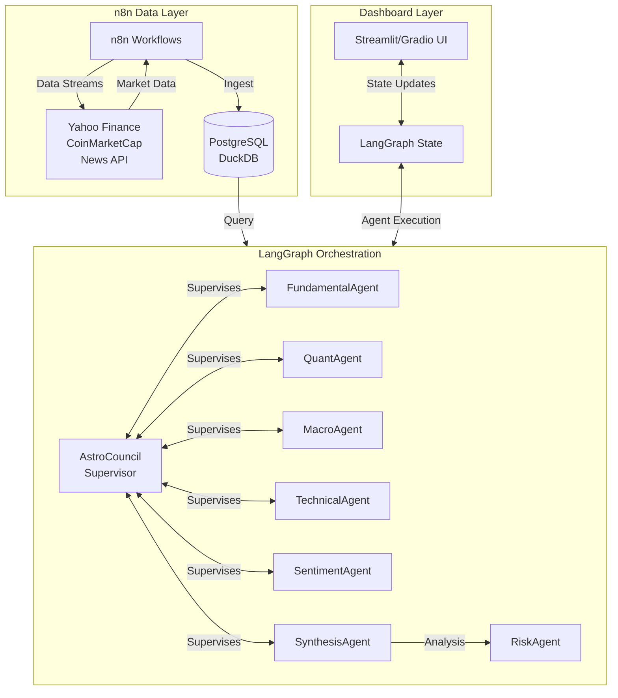

# Dashboard Evaluation: LangGraph vs n8n

## Executive Summary

For AstroFinSentinelV5's dashboard and workflow orchestration needs, **LangGraph is the recommended primary choice** with n8n as a secondary option for specific data ingestion pipelines. This hybrid approach provides the best of both worlds: LangGraph's robust state management for complex multi-agent workflows, combined with n8n's strength in event-driven data streams.

## LangGraph Evaluation

### Strengths for AstroFinSentinelV5

**1. State Management for Multi-Agent Orchestration**
AstroFinSentinelV5 already uses LangGraph internally (`langgraph_schema.py`, `orchestration/sentinel_v5.py`). LangGraph provides:
- Deterministic state machines for agent coordination
- Checkpointing for crash recovery
- Explicit multi-agent subgraph support
- Shared state across specialized agents (AstroCouncil, FundamentalAgent, QuantAgent, etc.)

**2. Complex Workflow Graphs**
The agent system involves cyclic, conditional workflows:
```
AstroCouncil (supervisor)
├── FundamentalAgent ─┐
├── QuantAgent ───────┼──► SynthesisAgent ──► RiskAgent
├── MacroAgent ───────┘
└── SentimentAgent
```
LangGraph handles this DAG structure naturally with conditional edges.

**3. Production Readiness**
LangGraph is trusted by Klarna, LinkedIn, Uber, and Replit for production workloads. It offers:
- Built-in human-in-the-loop moderation
- Real-time state streaming
- Multiple checkpoint backends (SQLite, Postgres, Redis)

### Integration Points

- **Existing**: `AstroFinSentinelV5/orchestration/sentinel_v5.py` uses LangGraph
- **Opportunity**: Extend to include TechnicalAgent, BullBot/BearBot, RiskAgent
- **Benefit**: Unified state management across all 9+ agents

## n8n Evaluation

### Strengths for AstroFinSentinelV5

**1. Data Ingestion Pipelines**
n8n excels at:
- Polling financial APIs (Yahoo Finance, CoinMarketCap)
- RSS/News feed aggregation
- Webhook receivers for market events
- Scheduled data refresh

**2. Event-Driven Actions**
- Trigger agent workflows on market events
- Send alerts via Slack/Email/Telegram
- Sync data to external databases

**3. No-Code Workflow Design**
Non-technical team members can modify data ingestion flows without touching Python code.

### Limitations

- Not designed for complex agent state management
- Agent orchestration would require custom Python nodes
- Less suitable for the cyclic, LLM-driven decision workflows

## Recommendation: Hybrid Architecture

### Architecture Diagram



### Responsibilities

| Layer | Technology | Responsibilities |
|-------|------------|-----------------|
| Agent Orchestration | **LangGraph** | Multi-agent coordination, state management, decision flows |
| Data Ingestion | **n8n** | API polling, webhooks, data normalization |
| Persistence | PostgreSQL/DuckDB | Historical data, backtest results |
| Dashboard | Streamlit/Gradio | Visualization, user interaction |

### Implementation Strategy

**Phase 1: Strengthen LangGraph Foundation**
1. Export all agents (TechnicalAgent, BullBot, BearBot, RiskAgent, SentimentAgent, SynthesisAgent)
2. Implement LangGraph supervisor pattern for all agents
3. Add checkpointing with SQLite for crash recovery

**Phase 2: Add n8n for Data**
1. Deploy n8n as sidecar service
2. Create workflows for:
   - Daily market data refresh
   - News aggregation pipeline
   - Alert routing
3. Connect to existing DuckDB backtest database

**Phase 3: Dashboard Integration**
1. Use LangGraph state as source of truth
2. n8n pushes data to shared database
3. Streamlit UI reads from database and LangGraph state

## Conclusion

LangGraph is the clear choice for AstroFinSentinelV5's agent orchestration layer due to its existing usage, robust state management, and suitability for complex multi-agent workflows. n8n complements it perfectly for data ingestion and event-driven pipelines. This hybrid approach avoids the limitations of forcing either technology beyond its strengths.

**Recommendation**: Implement Phase 1 (LangGraph expansion) immediately, then add n8n for data layer in Phase 2.
