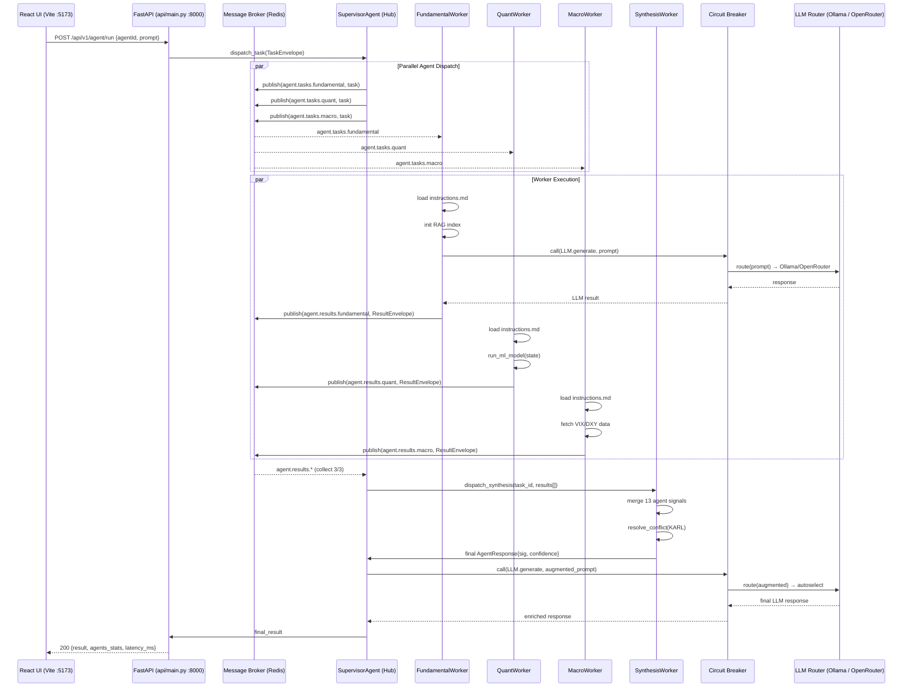
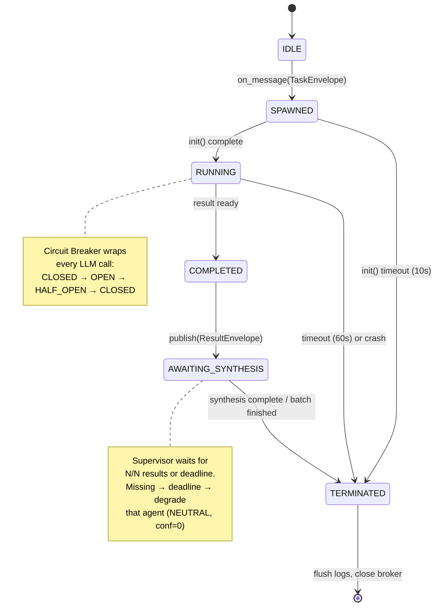
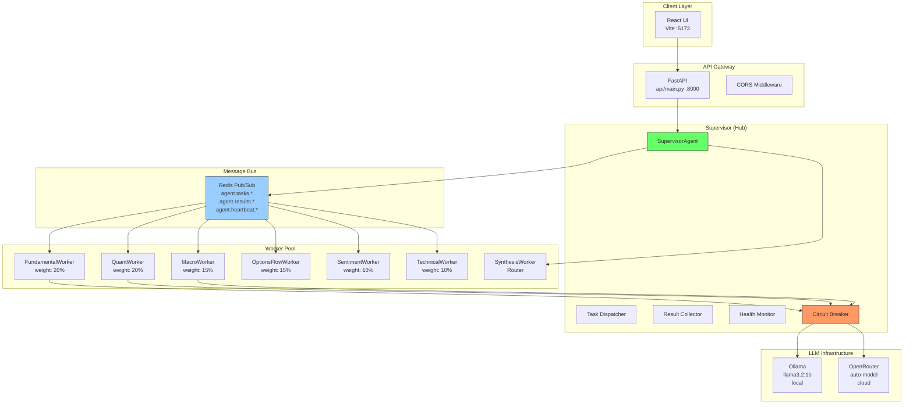
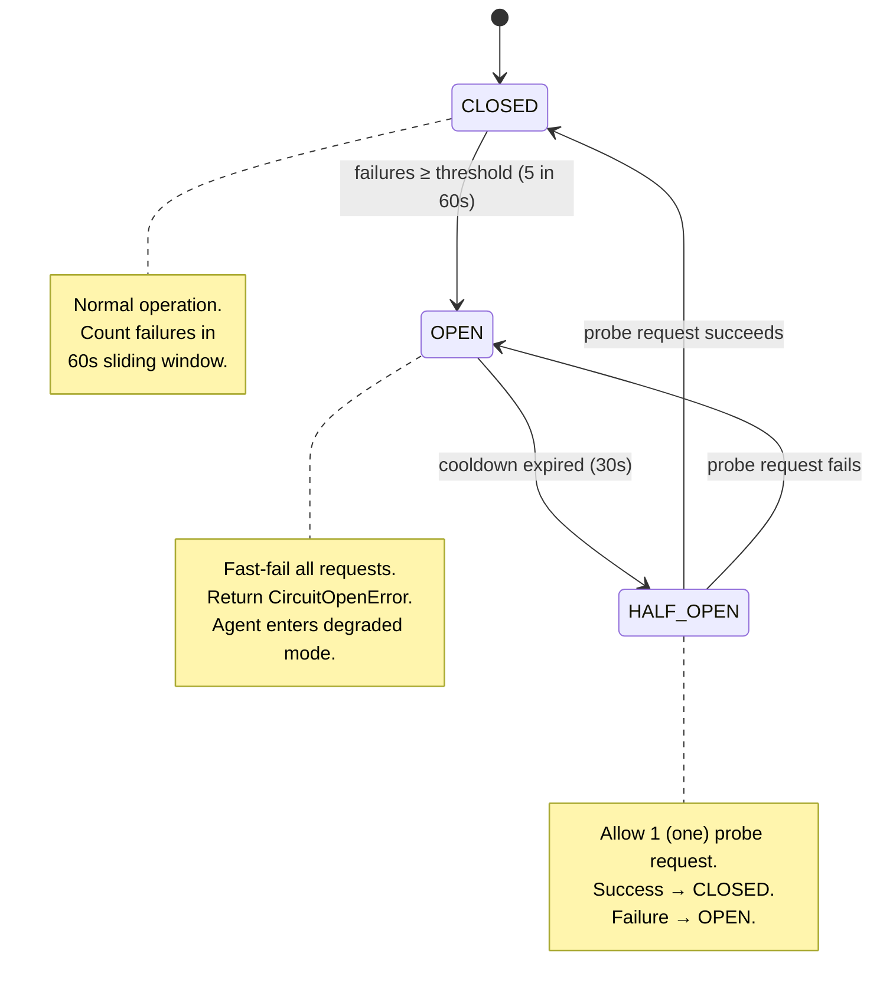
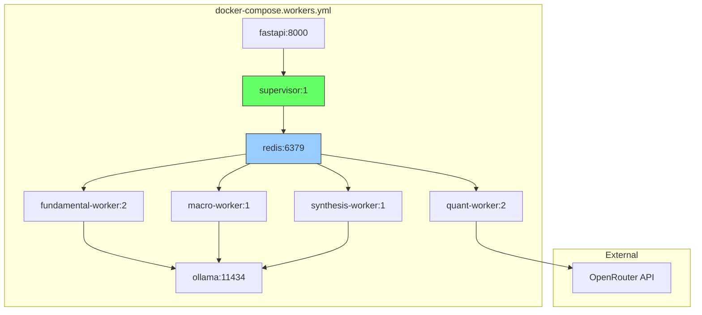

# AstroFin Sentinel — Architecture Diagrams

> Generated: 2026-07-18 | Format: Mermaid.js | ADR: [ADR-001](./ADR-001-distributed-multi-agent.md)

---

## 1. Sequence Diagram: Full Request Lifecycle

---

## 2. State Diagram: Agent Lifecycle

---

## 3. Component Diagram: System Topology

---

## 4. Circuit Breaker State Machine

---

## 5. Deployment Diagram (Sprint 4 Target)

---

*Diagrams rendered with Mermaid.js. View in GitHub Markdown preview or any Mermaid-compatible viewer.*
