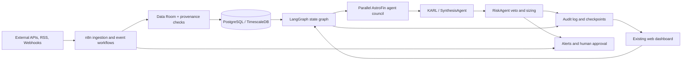

# Dashboard Evaluation: LangGraph and n8n

## Recommendation

Use **LangGraph as the primary orchestration and state layer** and add **n8n only at the data-ingestion and event-delivery boundary**. AstroFinSentinelV5 already has a LangGraph-oriented state schema and a Python-native agent council. Its agents return a shared `AgentResponse`, run in-process, and require explicit conflict arbitration, audit trails, checkpointing, and graceful degradation. Moving that decision loop into n8n would introduce a second orchestration model and make typed state, retries, and KARL arbitration harder to control.

n8n is still useful where it is strongest: scheduled API polling, RSS/news collection, webhooks, normalization, and notifications. It should write validated, provenance-bearing records into the Data Room or PostgreSQL/TimescaleDB and emit an event for the Python orchestrator. n8n must not become the source of trading truth or bypass `data_room/`; external data remains subject to the existing RAG-first and provenance rules. Start with LangGraph and existing persistence, then add n8n after one ingestion workflow has a clear operational need.

## LangGraph fit

LangGraph is a good fit for:

- Parallel execution of Fundamental, Macro, Quant, OptionsFlow, Sentiment, Technical, and Astro agents.
- Conditional routing when data quality is low, an agent degrades, or RiskAgent vetoes execution.
- Explicit state containing symbol, timeframe, source provenance, agent responses, conflicts, KARL adjustments, and final signal.
- Checkpointing and replay for backtests, incident recovery, and audit review.
- Human approval gates before any future execution adapter is allowed to place an order.

The main integration points are `langgraph_schema.py`, `orchestration/sentinel_v5.py`, `agents/_impl/synthesis_agent.py`, `core/checkpoint.py`, `core/history_db.py`, and the audit/KARL modules under `agents/_impl/amre/`. The exported GitAgent agents can be represented as graph nodes, but their canonical implementations remain in `agents/_impl/`.

## n8n fit

n8n is appropriate for low-code operational workflows:

- Scheduled collection of market, macro, earnings, and news data.
- RSS and news-feed fan-in for SentimentAgent.
- Webhook-driven market or calendar events.
- Alert routing to email, Telegram, Slack, or incident systems.
- Retry, rate-limit, and dead-letter handling around external connectors.

n8n is not the right place for KARL synthesis, weighted conflict resolution, risk vetoes, agent checkpoint state, or the authoritative trading signal. Those responsibilities belong to the Python/LangGraph boundary, where the existing contracts and tests apply.

## Suggested architecture

## Responsibility boundaries

| Boundary | Owner | Contract |
|---|---|---|
| External collection and scheduling | n8n | Retries, connector auth, normalized payload, event metadata |
| Data quality and provenance | Data Room | Canonical source, quality score, conflict journal, degradation state |
| Agent execution and graph state | LangGraph/Python | Typed state, parallel nodes, conditional edges, checkpoints |
| Conflict arbitration and final synthesis | SynthesisAgent/KARL | Weighted signal, conflict record, confidence adjustments |
| Risk refusal and position sizing | RiskAgent | Dynamic risk, stop loss, veto/approval decision |
| Persistence and replay | PostgreSQL/TimescaleDB + audit modules | History, checkpoints, JSONL audit trail |
| Visualization and human approval | Existing web dashboard | Read state, display provenance/conflicts, request approval |

## Rollout sequence

1. Keep the current Python orchestration path as the production source of truth.
2. Add LangGraph nodes/checkpoints around the existing canonical agents; do not duplicate agent logic in n8n.
3. Add one n8n workflow for a non-destructive ingestion path, such as RSS/news aggregation, writing only through the Data Room contract.
4. Add metrics for freshness, provenance quality, ingestion failures, graph latency, degraded agents, and risk vetoes.
5. Add further n8n workflows only when a connector or event trigger removes measurable operational work.

**Decision:** LangGraph first; n8n complementary, not a replacement. This preserves the platform's in-process, auditable multi-agent architecture while allowing n8n to handle integration-heavy workflows safely.
