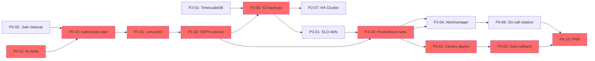

# 🔗 Dependencies Map — AstroFin Sentinel v1.0.0

> **Status:** ✅ Active (last reviewed 2026-07-04)
> **Owner:** Tech Lead (`@asurdev`)
> **Назначение:** визуальная карта зависимостей между 87 задачами + внешними сервисами. Помогает при планировании спринтов и эскалации блокеров.

---

## 1. 🎯 Назначение

**Dependencies Map** дополняет бэклог двумя измерениями:

1. **Internal task-to-task** — какая задача блокирует другую (с учётом sprint boundaries)
2. **External service-to-task** — какие внешние API/инфраструктура критичны

Используется для:
- **Sprint planning** — задачи с нерешёнными dependencies → откладываются
- **Daily standup** — быстрый ответ "почему заблокировано?"
- **Onboarding** — новый разработчик видит critical path

---

## 2. 🚨 Critical Path (минимальный путь до GA)



**Критические задачи (16 шт, нельзя задерживать):**

P0-01, P0-02, P0-03, P1-01, P1-02, P2-01, P2-05, P3-01, P3-03, P3-04, P4-01, P4-11, P5-01, P5-02, P5-10, P5-13

**Если любая задержится** → все downstream-фазы откладываются пропорционально.

---

## 3. 📊 Phase-to-Phase Dependencies

```markdown
Phase 0 (Подготовка)
   │
   ├─► Phase 1 (API Hardening)         [зависит: P0-01, P0-04]
   │      │
   │      ├─► Phase 2 (Database)       [зависит: P1-01, P1-02]
   │      │      │
   │      │      ├─► Phase 3 (Observability)  [зависит: P2-01, P2-05]
   │      │      │      │
   │      │      │      └─► Phase 4 (Security) [зависит: P3-03, P3-04]
   │      │      │             │
   │      │      │             └─► Phase 5 (Deploy+GA) [зависит: P4-11, P5-01]
```

**Граничные условия:**
- Phase 2 не может стартовать, пока P1-01/P1-02 не готовы
- Phase 3 не может стартовать, пока P2-01 (TimescaleDB) не в проде
- Phase 5 не может стартовать, пока P3-03/P4-11 не зелёные

---

## 4. 🧩 Task-Level Dependency Graph (по фазам)

### Phase 0 → Phase 1

| Task | Depends on | Sprint | Блокирует |
|---|---|---|---|
| P0-01 (fix tests) | — | W1 | P2-08, P2-11, P3-12 |
| P0-02 (.bak cleanup) | — | W1 | — |
| P0-03 (submodule plan) | — | W1 | P5-11, P5-13 |
| P0-04 (release branch) | — | W1 | все PR-merge |
| P0-05 (lock file) | — | W1 | reproducible CI |
| P0-06 (bandit sweep) | — | W1 | P4-03 |
| P0-07 (ADR-0001) | — | W1 | P4-12 |
| P1-01 (.env.prod) | P0-04 | W1 | P1-02, P2-05 |
| P1-02 (SOPS) | P1-01 | W1 | P1-03, P2-05, P4-19 |
| P1-03 (JWT) | — | W1 | P1-04, P1-16 |
| P1-04 (rate limit) | P1-03 | W1-W2 | — |
| P1-05 (Pydantic v2) | — | W1-W2 | P1-10 |
| P1-06 (CORS) | — | W1 | — |
| P1-07 (security headers) | — | W1 | P1-08 |
| P1-08 (error handler) | P1-07 | W1 | P1-10 |
| P1-09 (request-ID) | — | W1 | P1-08, P3-02 |
| P1-10 (OpenAPI) | P1-05, P1-08 | W1-W2 | P4-13 |
| P1-11 (print→logger) | — | W1 | — |
| P1-12 (graceful shutdown) | — | W1 | P2-08 |
| P1-13 (/livez, /readyz) | — | W1 | P2-08, P5-03 |
| P1-14 (subprocess safety) | — | W1 | P4-01 |
| P1-15 (compare_digest) | — | W1 | P4-01 |
| P1-16 (RBAC + audit) | P1-03 | W1 | P2-14, P4-17 |

### Phase 2 → Phase 3

| Task | Depends on | Sprint | Блокирует |
|---|---|---|---|
| P2-01a (TimescaleDB ext) | P0-01 | W2 | P2-01b, P2-02 |
| P2-01b (hypertable) | P2-01a | W2 | P2-02, P2-03, P2-07, P2-13, P3-15 |
| P2-02 (pgvector RAG) | P2-01b | W3 | P3-15 |
| P2-03 (RLS) | P2-01b | W3 | P2-14, P2-15 |
| P2-04 (connection pool) | P2-01b | W3 | P5-05 |
| P2-05 (S3 backups) | P1-02 | W2 | P2-06, P2-07, P4-01 |
| P2-05b (backup verify) | P2-05 | W2 | — |
| P2-06 (DR runbook) | P2-05 | W2 | P4-11, P4-16, P5-04 |
| P2-07 (HA Cluster) | P2-05, P2-01b | W3 | P2-09, P5-04 |
| P2-08 (migration CI) | P0-01, P1-12, P1-13 | W2 | P2-11, P5-03 |
| P2-09 (read-replica) | P2-07 | W3 | P5-05 |
| P2-10 (slow-query) | P2-13 | W3 | P5-05 |
| P2-11 (data integrity) | P2-08 | W3 | — |
| P2-12 (TLS) | P2-01b | W2 | P2-07 |
| P2-13 (vacuum tuning) | P2-01b | W3 | P2-10 |
| P2-14 (DB audit log) | P2-03 | W3 | P4-17 |
| P2-15 (tenant isolation) | P2-03 | W3 | (future) |

### Phase 3 → Phase 4

| Task | Depends on | Sprint | Блокирует |
|---|---|---|---|
| P3-01 (SLO defs) | P2-05 | W3 | P3-02, P3-03, P3-05, P3-11, P4-11 |
| P3-02 (SLI exporters) | P3-01, P1-09 | W3-W4 | P3-03 |
| P3-03 (Prometheus rules) | P3-01, P3-02 | W4 | P3-04, P3-05, P3-10, P5-01, P5-02 |
| P3-04 (Alertmanager) | P3-03 | W4 | P3-11, P4-11, P5-08, P5-12 |
| P3-05 (Grafana v2) | P3-01 | W4 | P4-11 |
| P3-06 (Tempo backend) | — | W3 | P3-07, P3-08 |
| P3-07 (trace propagation) | P3-06 | W4 | P3-13, P3-15 |
| P3-08 (Loki) | P3-06 | W4 | P3-09 |
| P3-09 (PII redaction) | P3-08 | W4 | P3-13 |
| P3-10 (chaos) | P3-03 | W4 | — |
| P3-11 (synthetic) | P3-01, P3-04 | W4 | P4-11 |
| P3-12 (perf baseline) | — | W4 | P5-05, P5-06 |
| P3-13 (Sentry) | P3-07, P3-09 | W4 | P4-11 |
| P3-14 (FinOps) | — | W4 | — |
| P3-15 (APM workers) | P3-07, P2-02 | W4 | — |

### Phase 4 → Phase 5

| Task | Depends on | Sprint | Блокирует |
|---|---|---|---|
| P4-01 (threat model) | P1-14, P1-15, P2-05 | W4 | P4-02 |
| P4-02 (pen-test) | P4-01 | W5 | GA gate |
| P4-03 (SAST/DAST) | P0-01 | W4 | merge gate |
| P4-04 (dep vuln scan) | — | W4 | merge gate |
| P4-05 (image scan) | — | W4 | P4-06 |
| P4-06 (SLSA L3) | P4-05 | W5 | — |
| P4-07 (SECURITY.md) | — | W4 | P4-20 |
| P4-08 (PRIVACY.md) | — | W4 | P4-09 |
| P4-09 (SOC2 readiness) | P4-08 | W5 | post-GA |
| P4-10 (bus factor) | — | W3-W4 | P5-08 |
| P4-11 (runbook) | P3-01, P3-04, P3-05, P3-11, P3-13, P2-06 | W4 | P5-08, P5-09 |
| P4-12 (ADRs) | Phase 1–3 | W4 | — |
| P4-13 (API doc site) | P1-10 | W5 | — |
| P4-14 (CHANGELOG) | — | W5 | P5-14 |
| P4-15 (user docs) | — | W4-W5 | — |
| P4-16 (DR drill) | P2-06 | W5 | — |
| P4-17 (compliance log) | P2-14 | W5 | — |
| P4-18 (NetworkPolicy) | — | W4 | P5-01 |
| P4-19 (secret rotation) | P1-02 | W4 | — |
| P4-20 (bug bounty) | P4-07 | W5 | post-GA |

### Phase 5 (Deploy + GA)

| Task | Depends on | Sprint | Блокирует |
|---|---|---|---|
| P5-01 (canary deploy) | P3-03, P4-18 | W5 | P5-02, P5-14 |
| P5-02 (auto-rollback) | P5-01, P3-03 | W5 | P5-10 |
| P5-03 (DB migration gate) | P2-08 | W5 | P5-14 |
| P5-04 (multi-region DR) | P2-07, P2-05 | W5 | — |
| P5-05 (perf optimization) | P3-12, P2-04, P2-09 | W5 | GA SLO |
| P5-06 (capacity planning) | P3-12 | W5 | — |
| P5-07 (feature flags) | — | W5 | P5-09 |
| P5-08 (on-call) | P4-10, P4-11, P3-04 | W5 | P5-10 |
| P5-09 (postmortems) | P4-11, P5-07 | W5 | — |
| P5-10 (PRR) | **All** | W5 | P5-14 |
| P5-11 (submodule → folder) | P0-03 | W5 | — |
| P5-12 (Telegram bot) | P3-04 | W5 | — |
| P5-13 (submodule → subtree) | P0-03 | W5 | P5-14 |
| P5-14 (GA release v1.0.0) | **All** | W5 | DONE |
| P5-15 (decommission dev) | P0-01 | W5 | — |

---

## 5. 🌐 External Service Dependencies

| Service | Где используется | Тип зависимости | Fallback | Owner |
|---|---|---|---|---|
| **PostgreSQL 15 + TimescaleDB** | Phase 2 (всё) | 🟥 Critical (no service = full outage) | SQLite (dev only, R-08 уже реализован) | Backend |
| **Redis 7** | Session cache, RAG dual-write | 🟧 High (degraded experience) | in-memory LRU | Backend |
| **S3-compatible storage** | WAL-G backups (P2-05) | 🟥 Critical (data loss risk) | Local disk + cron to offsite | DevOps |
| **Swiss Ephemeris** | Astro-агенты | 🟨 Medium (no astro signal) | Skip astro agents, weight others | Backend |
| **CoinGecko API** | Crypto prices | 🟨 Medium (degraded signal) | Binance fallback | Backend |
| **Binance API** | OHLCV data | 🟥 Critical (no crypto data) | CoinGecko fallback (less detail) | Backend |
| **SEC EDGAR** | 13F filings | 🟨 Medium (delayed signal) | Cached data | Backend |
| **Fear & Greed Index** | Sentiment | 🟢 Low (alternative_sentiment) | — | Backend |
| **Yahoo Finance** | VIX, DXY, Gold | 🟧 High (macro blind) | Skip macro agent | Backend |
| **Polygon.io** | Options flow (future) | 🟢 Optional | Skip OptionsFlow agent | Backend |
| **GitHub API** | Project board, CI, releases | 🟥 Critical (no releases) | Self-hosted Gitea (post-GA) | DevOps |
| **PyPI** | Deps install | 🟥 Critical (no build) | Vendor critical packages | Backend |
| **Docker Hub / GHCR** | Container images | 🟥 Critical (no deploy) | Self-hosted registry | DevOps |
| **Sentry** | Error tracking | 🟧 High (blind to prod errors) | Logs only | DevOps |
| **Grafana Cloud / OSS** | Dashboards | 🟧 High (no viz) | Raw Prometheus queries | DevOps |
| **Tempo / Jaeger** | Distributed tracing | 🟨 Medium (debugger harder) | Log correlation by trace_id | DevOps |
| **Loki** | Log aggregation | 🟨 Medium (no centralized logs) | grep + journalctl | DevOps |
| **vsellm.ru** | LLM API (Hermes?) | 🟧 High (no agent reasoning) | Local LLM (slow) | Backend |
| **Telegram Bot API** | Alerts, /signal command | 🟨 Medium (no UX) | Email only | DevOps |
| **GitHub Container Registry** | Image hosting | 🟥 Critical (no deploy) | Self-hosted registry | DevOps |

**Total:** 20 external services, 7 🟥 Critical, 6 🟧 High, 6 🟨 Medium, 1 🟢 Optional.

---

## 6. 🔄 Inter-Sprint Dependency Check

### W1 (Sprint 1) → W2

| W1 deliverable | W2 потребляет | Если W1 fail |
|---|---|---|
| P0-01 (fix tests) | P2-08, P2-11 | Sprint 2 не запускается |
| P1-01 (.env.prod) | P1-02, P2-05 | P2-05 backup невозможен |
| P1-02 (SOPS) | P1-03, P2-05 | P2-05 без секретов |
| P1-03 (JWT) | P1-04, P1-16 | P1-04 невозможен |
| P1-13 (/livez, /readyz) | P2-08 | Migration CI не валиден |
| P0-04 (release branch) | все PR | Невозможно merge в релизную ветку |

### W2 → W3

| W2 deliverable | W3 потребляет | Если W2 fail |
|---|---|---|
| P2-01a (TimescaleDB ext) | P2-02, P2-03, P2-07, P2-13 | P2-02 RAG невозможен |
| P2-01b (hypertable) | P2-02, P2-03 | RAG, RLS блокированы |
| P2-05 (S3 backups) | P2-07, P2-06, P3-01 | HA, DR, SLO блокированы |
| P2-08 (migration CI) | P2-11 | Data integrity tests не валидны |
| P2-12 (TLS) | P2-07 | HA Cluster без TLS = compliance fail |

### W3 → W4

| W3 deliverable | W4 потребляет | Если W3 fail |
|---|---|---|
| P2-02 (pgvector RAG) | P3-15 | APM workers без RAG-контекста |
| P2-03 (RLS) | P2-14, P2-15 | Compliance неполное |
| P2-07 (HA Cluster) | P2-09, P5-04 | Read-replica routing невозможен |
| P3-01 (SLO defs) | P3-02, P3-03, P3-05, P3-11 | Observability без SLO = no alerts |
| P3-06 (Tempo) | P3-07, P3-08 | Trace propagation fix некуда |

### W4 → W5

| W4 deliverable | W5 потребляет | Если W4 fail |
|---|---|---|
| P3-03 (Prometheus rules) | P5-01, P5-02 | Canary без auto-rollback |
| P3-04 (Alertmanager) | P5-08, P5-12 | On-call без алертов |
| P4-01 (threat model) | P4-02 | Pen-test не на что опираться |
| P4-11 (runbook) | P5-08, P5-09 | On-call слепой |
| P4-18 (NetworkPolicy) | P5-01 | Canary без network isolation |

---

## 7. 🧪 Dependency Check в CI

Автоматические проверки в `.github/workflows/project-board-lint.yml`:

| Check | Что делает | Когда |
|---|---|---|
| `lint-backlog-structure` | Парсит `PRODUCTION_BACKLOG.md`, проверяет что все 87 задач имеют ID, приоритет, фазу, owner | На push в main |
| `lint-sprint-files` | Парсит `SPRINT_*.md`, проверяет что задачи в спринтах существуют в бэклоге | На push в main |
| `validate-project-fields` | Issue template содержит обязательные поля (Phase, MoSCoW, Sprint, Owner) | На push в main |
| `check-issue-templates` | Issue templates валидны YAML, required fields не пустые | На push в main |

См. `scripts/lint_project_board.py` для деталей реализации.

---

## 8. 🛠️ Tooling & Scripts

| Скрипт | Назначение |
|---|---|
| `scripts/lint_project_board.py` | Валидация структуры бэклога и спринтов (локально + CI) |
| `scripts/seed_project_board.py` | Idempotent seed: создание issues из бэклога с правильными labels/milestones |

Запуск локально:

```bash
# Линтер бэклога
python scripts/lint_project_board.py

# Seed project board (dry-run)
python scripts/seed_project_board.py --dry-run --phase 2

# Реальный seed (после подтверждения)
python scripts/seed_project_board.py --phase 2 --limit 18
```

---

## 9. 🔗 Связанные документы

- `file 'PRODUCTION_BACKLOG.md'` — 87 задач с dependencies в колонке
- `file 'SPRINT_*.md'` — execution plan, раздел "Зависимости от Sprint N"
- `file 'docs/RISK_REGISTER.md'` — риски, порождённые зависимостями (R-01, R-06, R-11)
- `file 'docs/DEFINITION_OF_DONE.md'` — критерии "задача завершена = все dependents могут стартовать"
- `file 'docs/RELEASE_CHECKLIST.md'` — go/no-go gate на основе critical path

---

> 📌 **Обновляется:** при изменении бэклога (новые задачи, изменение dependencies). Авто-линтер в CI подсвечивает inconsistencies.
